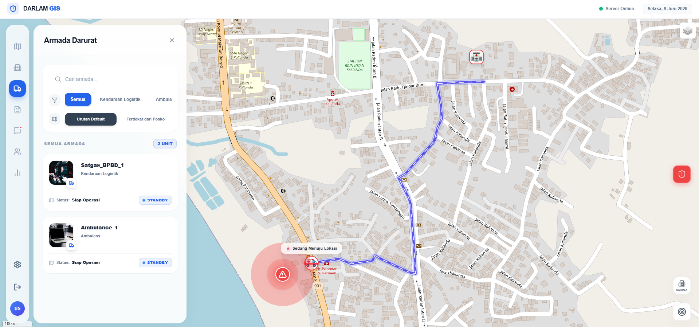
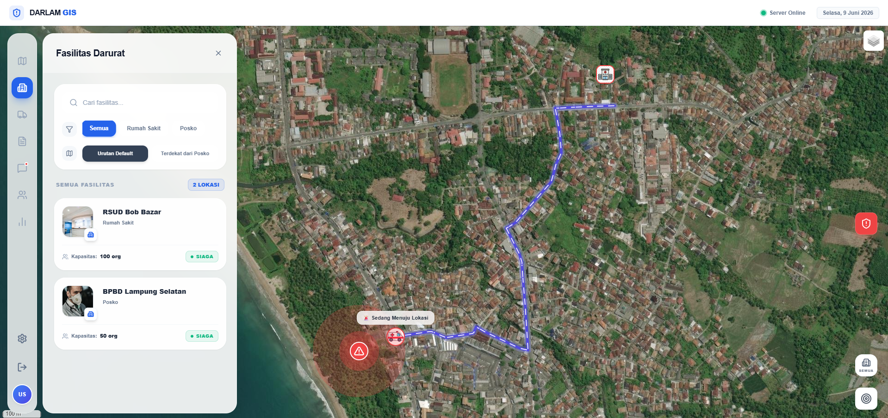
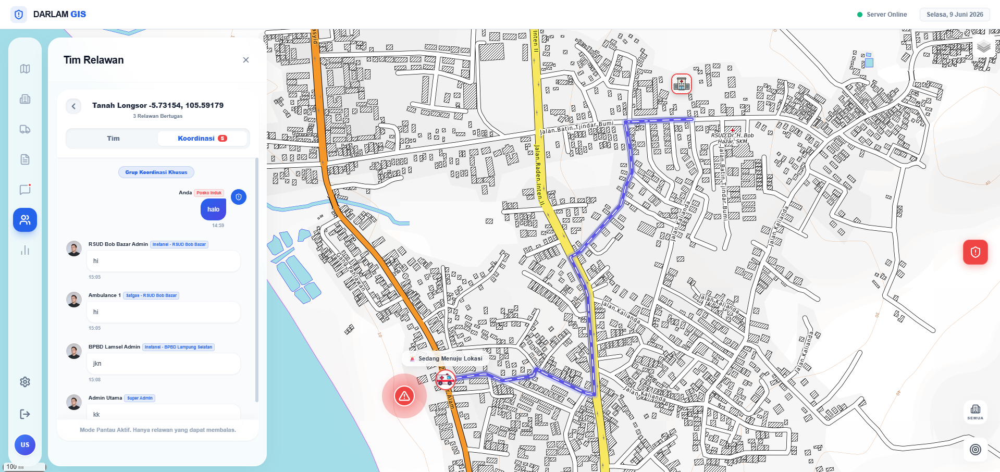
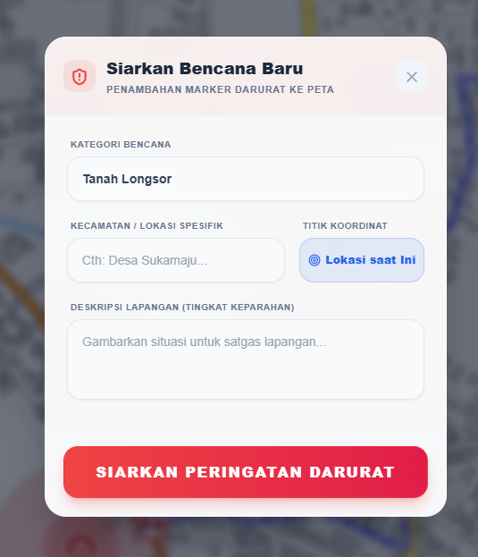

# 🗺️ DISASTER RESPONSE GIS

<p align="center">
  
  
  
  
  
</p>

<p align="center">
  Sistem Pendukung Keputusan Spasial (SPKG) cerdas berbasis Web GIS untuk mengoptimalkan penanganan darurat bencana alam. Menggunakan algoritma <b>Dijkstra via pgRouting</b> untuk penentuan rute evakuasi dinamis dengan antarmuka analitik <i>Premium Dashboard</i>.
</p>

<p align="center"></p>

## ✨ Fitur Utama

<table align="center" width="100%">
  <tr>
    <td width="50%" valign="top">
      <b>Dynamic Dijkstra Routing</b><br/>
      Kalkulasi rute evakuasi terpendek secara <i>real-time</i> yang mampu memutar arah apabila infrastruktur jalan rusak/tertutup akibat bencana.
    </td>
    <td width="50%" valign="top">
      <b>Live Spatial Fleet Dispatch</b><br/>
      Sistem manajemen panggilan darurat yang mendistribusikan laporan ke armada logistik dan medis terdekat secara presisi.
    </td>
  </tr>
  <tr>
    <td width="50%" valign="top">
      <b>Executive GIS Dashboard</b><br/>
      Antarmuka Web interaktif dengan desain <i>Premium Glassmorphism</i> yang responsif memantau pergerakan relawan dan posko.
    </td>
    <td width="50%" valign="top">
      <b>Decomposition Database</b><br/>
      Topologi graf berskala enterprise menggunakan PostGIS dan pgRouting untuk komputasi jarak dan intersection berlambat rendah.
    </td>
  </tr>
</table>

<p align="center"></p>

## 📸 Antarmuka Sistem (Premium Dashboard)

<table align="center" width="100%">
  <tr>
    <td width="50%" align="center">
      <b>Mode Armada & Radius Geofencing</b><br/>
      
    </td>
    <td width="50%" align="center">
      <b>Peta Satelit & Dijkstra Routing</b><br/>
      
    </td>
  </tr>
  <tr>
    <td width="50%" align="center" valign="middle">
      <b>Live Chat Koordinasi Relawan</b><br/>
      
    </td>
    <td width="50%" align="center" valign="middle">
      <b>Panel Pelaporan Bencana</b><br/>
      
    </td>
  </tr>
</table>

<p align="center"></p>

## 🧮 Arsitektur Algoritma & Geospasial

Sistem mengeksekusi operasi spasial kompleks langsung pada level basis data:

**Topologi Geospasial (Database Metrics):**

- **PostGIS (Radius)** - Menggunakan operasi kueri spasial `(ST_DWithin)`
- **pgRouting (Graph)** - Membangun topologi jaringan jalan raya `(Cost & Reverse Cost)`

**Implementasi Algoritma:**

1. **Dijkstra's Shortest Path:** Digunakan via fungsi bawaan `pgr_dijkstra` untuk mencari rute terefisien dari titik awal ke koordinat bencana.
2. **Dynamic Cost Penalty:** Ketika terdapat ruas jalan yang tertutup, sistem secara otomatis menginjeksi nilai pembobot tak terhingga `(999999999)` pada ruas tersebut untuk memicu <i>rerouting</i>.

<p align="center"></p>

## 🚀 Panduan Instalasi & Eksekusi

Sistem ini berarsitektur terpisah (*decoupled*) dan membutuhkan dua terminal.

### Bagian 1: Menjalankan Backend (Server API)

1. **Migrasi Database Terpusat**
   ```bash
   cd backend
   python setup_tables.py
   python setup_routing.py
   python setup_users.py
