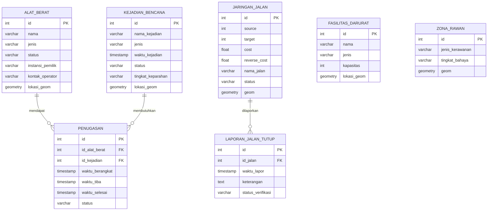

# Entity Relationship Diagram (ERD) - DARLAM

```mermaid
erDiagram
    ALAT_BERAT ||--o{ PENUGASAN : "mendapat"
    KEJADIAN_BENCANA ||--o{ PENUGASAN : "membutuhkan"
    JARINGAN_JALAN ||--o{ LAPORAN_JALAN_TUTUP : "dilaporkan"

    ALAT_BERAT {
        int id PK
        varchar nama
        varchar jenis
        varchar status
        varchar instansi_pemilik
        varchar kontak_operator
        geometry lokasi_geom
    }

    KEJADIAN_BENCANA {
        int id PK
        varchar nama_kejadian
        varchar jenis
        timestamp waktu_kejadian
        varchar status
        varchar tingkat_keparahan
        geometry lokasi_geom
    }

    PENUGASAN {
        int id PK
        int id_alat_berat FK
        int id_kejadian FK
        timestamp waktu_berangkat
        timestamp waktu_tiba
        timestamp waktu_selesai
        varchar status
    }

    JARINGAN_JALAN {
        int id PK
        int source
        int target
        float cost
        float reverse_cost
        varchar nama_jalan
        varchar status
        geometry geom
    }

    LAPORAN_JALAN_TUTUP {
        int id PK
        int id_jalan FK
        timestamp waktu_lapor
        text keterangan
        varchar status_verifikasi
    }

    FASILITAS_DARURAT {
        int id PK
        varchar nama
        varchar jenis
        int kapasitas
        geometry lokasi_geom
    }

    ZONA_RAWAN {
        int id PK
        varchar jenis_kerawanan
        varchar tingkat_bahaya
        geometry geom
    }
```
